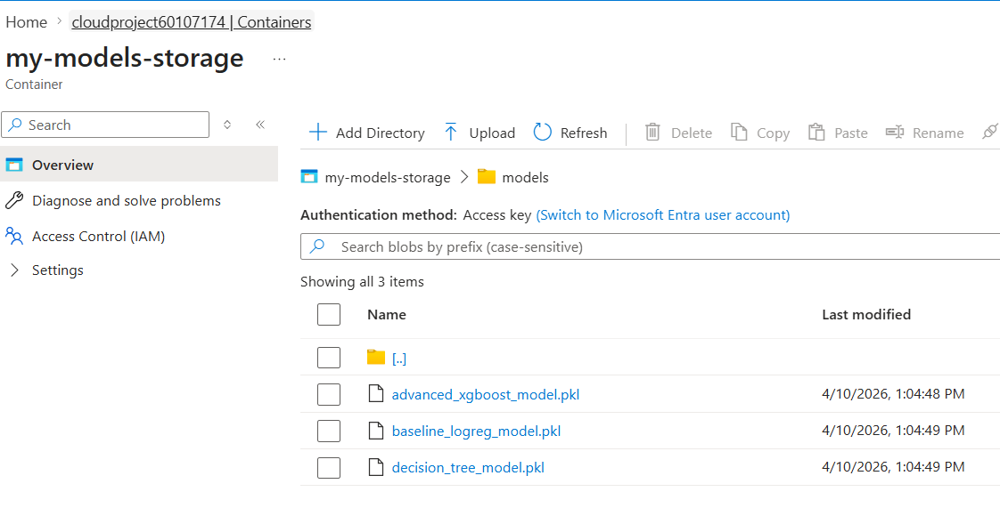
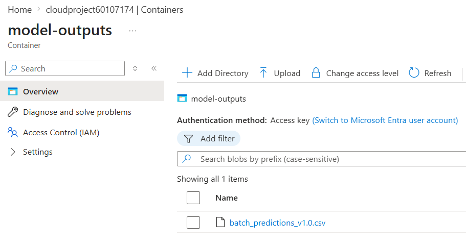
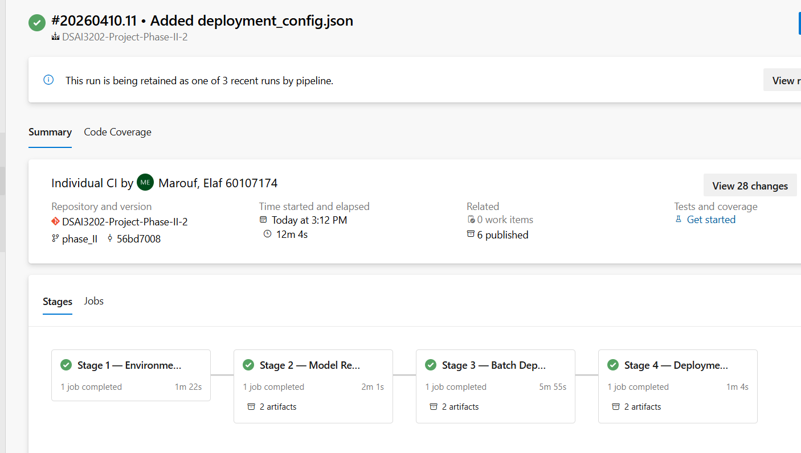

# Predicting Crime Types by Location & Time-Series Data
### DSAI3202 — Winter 2026 | Project Phase 2

**Authors:** Nur Afiqah · 60306981 &nbsp;|&nbsp; Elaf Marouf · 60107174

---

## Table of Contents
1. [Phase 2 Overview](#1-phase-2-overview)
2. [Repository Structure](#2-repository-structure)
3. [How to Run](#3-how-to-run)
4. [Task II.1 — Model Development](#4-task-ii1--model-development)
5. [Task II.2 — Model Validation](#5-task-ii2--model-validation)
6. [Task II.3 — Model Versioning & Registration](#6-task-ii3--model-versioning--registration)
7. [Task II.4 — Deployment](#7-task-ii4--deployment)
8. [Task II.5 — Deployment Validation](#8-task-ii5--deployment-validation)
9. [Azure Infrastructure](#9-azure-infrastructure)
10. [Limitations & Known Issues](#10-limitations--known-issues)
11. [Contributions](#11-contributions)

---

## 1. Phase 2 Overview

Phase 2 builds on the data pipeline established in Phase 1 to train, validate, version, and deploy machine learning models for predicting Chicago crime types.

### Hypothesis (carried from Phase 1)
> By building a classification model following the pipeline process outlined in this project, our aim is to help the police force decide resource allocation at the start of each shift by predicting the crime type so that **response time improves from baseline by 15%** under limited patrol cars.

### Phase 2 Scope

| Task | Description | Status |
|------|-------------|--------|
| II.1 | Model Development | ✅ Complete |
| II.2 | Model Validation | ✅ Complete |
| II.3 | Model Versioning & Registration | ✅ Complete |
| II.4 | Deployment | ✅ Complete |
| II.5 | Deployment Validation | ✅ Complete |

### Input
`processed-data/chicago_crime_features_v1.0.csv` — 7,282,602 rows × 10 columns, produced by Phase 1 feature engineering pipeline, stored in Azure Blob Storage.

### Output
`model-outputs/batch_predictions_v1.0.csv` — 500,000 rows scored with predicted crime type, predicted label integer, and confidence score, stored in Azure Blob Storage.

---

## 2. Repository Structure

```
DSAI3202_Project/
├── data/
│   ├── catalog/                              <- Phase 1 metadata (unchanged)
│   │   ├── label_encoding.json               <- crime_type_label integer → string mapping
│   │   └── ...
│   └── phase_ii/                             <- Phase 2 artifacts
│       ├── crime_modeling.ipynb              <- Training notebook (XGBoost, DT, LogReg)
│       ├── advanced_xgboost_model.pkl        <- Champion model (131.9 MB)
│       ├── decision_tree_model.pkl           <- Intermediate baseline (2.2 MB)
│       ├── baseline_logreg_model.pkl         <- Logistic Regression baseline
│       ├── model_comparison_metrics.csv      <- Accuracy, F1, balanced accuracy comparison
│       └── model_registry.json              <- Version + metadata record for all 3 models
├── deployment/
│   ├── batch_predictions_v1.0.csv           <- 500k scored predictions (local copy)
│   ├── deployment_config.json               <- Input/output interface + batch stats
│   └── validation_report.json              <- 12/12 tests PASS
├── scripts/
│   ├── register_model.py                    <- Task II.3: registers models to Azure Blob
│   ├── upload_models.py                     <- Uploads all 3 .pkl files to my-models-storage
│   ├── deploy_model.py                      <- Task II.4: batch scoring + Azure upload
│   └── validate_deployment.py              <- Task II.5: functional + consistency tests
├── logs/
│   ├── register_model.log
│   ├── deploy_model.log
│   └── validate_deployment.log (generated on run)
├── Screenshots/
│   ├── azure_models_storage.png             <- my_models_storage with all 3 .pkl files
│   └── azure_model_outputs_container.png   <- model-outputs with batch_predictions_v1.0.csv
└── README.md                                <- This file
```

---

## 3. How to Run

### Prerequisites
```bash
pip install xgboost scikit-learn pandas numpy joblib azure-storage-blob azure-ai-ml azure-identity
```

### Step 1 — Train models
Open and run `data/phase_ii/crime_modeling.ipynb` in order. This reads the feature matrix from Azure Blob Storage, trains all 3 models, and saves `.pkl` files locally.

### Step 2 — Upload models to Azure
```bash
python scripts/upload_models.py
```
Uploads all 3 `.pkl` files to the `my-models-storage` container in Azure Blob Storage.

### Step 3 — Register models
```bash
python scripts/register_model.py
```
Attempts Azure ML Model Registry registration; falls back to updating `data/phase_ii/model_registry.json` with full metadata if interactive auth is unavailable.

### Step 4 — Run batch deployment
```bash
python scripts/deploy_model.py
```
Reads 500,000 rows from `processed-data/chicago_crime_features_v1.0.csv` in Azure Blob, runs batch predictions, and uploads results to `model-outputs/batch_predictions_v1.0.csv`.

### Step 5 — Validate deployment
```bash
python scripts/validate_deployment.py
```
Runs 12 functional tests and writes `deployment/validation_report.json`.

---

## 4. Task II.1 — Model Development

### Algorithm Selection & Justification

Three models were trained on the same feature set and data split to enable direct comparison.

| Model | Role | Justification |
|-------|------|---------------|
| **Logistic Regression** | Baseline | Fast, interpretable, establishes minimum acceptable accuracy for a linear classifier. Uses `StandardScaler` pipeline to normalise features. |
| **Decision Tree** | Intermediate baseline | Non-linear, no scaling required, interpretable decision paths. `max_depth=12` limits size to remain saveable. |
| **XGBoost** | Champion | Gradient-boosted ensemble — handles class imbalance better than single trees, faster than Random Forest at this scale via `tree_method=hist`. |

### Feature Set

All models were trained on the same 7 features selected during Phase 1 feature engineering:

| Feature | Type | Source |
|---------|------|--------|
| `hour_sin` | float | Cyclical encoding of hour — preserves midnight continuity |
| `hour_cos` | float | Complement of hour_sin |
| `is_weekend` | bool | 1 if Saturday or Sunday |
| `is_night` | bool | 1 if hour 22:00–05:59 |
| `Latitude` | float64 | WGS84 — core spatial predictor |
| `Longitude` | float64 | WGS84 — core spatial predictor |
| `community_area_enc` | int | Label-encoded Community Area (1–77) |

**Target:** `crime_type_label` — integer-encoded Primary Type (0–28, 29 classes)

### Reproducibility

| Parameter | Value |
|-----------|-------|
| `random_state` / `random_seed` | `42` (all models) |
| Training rows | 500,000 (sampled from 7.28M with `random_state=42`) |
| Test rows | 100,000 |
| Train/test split | 80/20 (`test_size=0.2`) |
| Data version | `v1.0` (`chicago_crime_features_v1.0.csv`) |

### XGBoost Hyperparameters (Champion)

| Parameter | Value | Rationale |
|-----------|-------|-----------|
| `n_estimators` | 300 | Sufficient rounds for convergence on 500k rows |
| `max_depth` | 10 | Deep enough to capture spatial-temporal interactions |
| `learning_rate` | 0.1 | Standard — balances convergence speed vs overfitting |
| `tree_method` | `hist` | Histogram-based — essential for speed at this data scale |
| `random_state` | 42 | Reproducibility |

### Training Data Note
Models were trained on a 500,000-row sample rather than the full 7.28M rows due to Azure ML Compute memory constraints on the available instance tier (`Standard_DS1_v2`). The sample was drawn with `random_state=42`, making results fully reproducible.

---

## 5. Task II.2 — Model Validation

### Validation Strategy

- **Hold-out split**: 80/20 train/test, stratification not applied (class distribution maintained naturally at 500k sample size)
- **No data leakage**: `Arrest` (post-incident field) excluded at feature engineering stage; the test set is never seen during training
- **Baseline comparison**: all 3 models evaluated on the same test set with identical metrics

**Note on Logistic Regression split:** The logreg baseline used `shuffle=False` in its train/test split (temporal order preserved), while XGBoost and Decision Tree used `random_state=42` shuffle. This reflects a deliberate design choice — logreg approximates a temporal validation scenario, while the tree models are evaluated on a random hold-out. This difference is acknowledged as a limitation in Section 10.

### Evaluation Metrics

Four metrics were selected to capture both overall and per-class performance on this imbalanced 29-class problem:

| Metric | Why selected |
|--------|-------------|
| **Accuracy** | Overall correctness — interpretable but misleading on imbalanced data alone |
| **Balanced Accuracy** | Average recall per class — penalises models that ignore rare classes |
| **Macro F1-Score** | Unweighted mean F1 across all 29 classes — best indicator of per-class performance |
| **Weighted Precision** | Precision weighted by class support — reflects real-world prediction reliability |

### Results

| Model | Accuracy | Balanced Accuracy | Macro F1 | Weighted Precision |
|-------|----------|-------------------|----------|--------------------|
| Logistic Regression | 25.51% | 4.32% | 0.0279 | 0.1386 |
| Decision Tree | 27.39% | 6.14% | 0.0458 | 0.2152 |
| **XGBoost (Champion)** | **28.76%** | **9.18%** | **0.0768** | **0.2376** |

XGBoost leads on all four metrics and is selected as the champion model.

### Error Analysis

All models show a large gap between accuracy (~28%) and balanced accuracy (~9%), indicating that predictions are dominated by the two most frequent classes: **THEFT** and **BATTERY**, which together account for ~38% of all records. Rare crime types (e.g. ARSON, GAMBLING) are largely ignored by all models due to uncorrected class imbalance.

The Macro F1 of 0.0768 for XGBoost reflects this — most of the 29 classes have near-zero F1 individually. Addressing class imbalance (via `scale_pos_weight`, SMOTE, or class-weighted loss) is the primary lever for improving per-class performance in future iterations.

### Metric Artefacts
- `model_comparison_metrics.csv` — all 4 metrics for all 3 models, saved by the notebook
- `data/phase_ii/model_registry.json` — metrics embedded in model metadata for traceability

---

## 6. Task II.3 — Model Versioning & Registration

### Registration Approach

Models are versioned and registered to Azure Blob Storage under the `my_models_storage` datastore, which is connected to the `cloudproject60107174` Azure ML workspace. This provides full traceability between the training data version, feature set, and deployed artifact.

Azure ML SDK v2 (`MLClient.models.create_or_update`) is called first in `register_model.py`; the script falls back to a local registry record if interactive authentication is unavailable in the execution environment.

### Registered Models

| Model Name | Version | Azure Blob Path | Champion |
|-----------|---------|----------------|---------|
| `crime-classifier-xgboost` | 1 | `models/advanced_xgboost_model.pkl` | ✅ |
| `crime-classifier-decision-tree` | 1 | `models/decision_tree_model.pkl` | — |
| `crime-classifier-logreg-baseline` | 1 | `models/baseline_logreg_model.pkl` | — |

**Datastore:** `my_models_storage` | **Storage Account:** `cloudproject60107174` | **Resource Group:** `rg-60107174`

### Model Metadata (all models share)

| Field | Value |
|-------|-------|
| Training data version | `v1.0` |
| Training data path | `processed-data/chicago_crime_features_v1.0.csv` |
| Feature set | `hour_sin, hour_cos, is_weekend, is_night, Latitude, Longitude, community_area_enc` |
| Target | `crime_type_label` |
| Classes | 29 |
| Training rows | 500,000 |
| Test rows | 100,000 |
| Random seed | 42 |

Full metadata record: `data/phase_ii/model_registry.json`

### Screenshot

**Models in Azure Blob Storage (`my_models_storage > models/`)**



---

## 7. Task II.4 — Deployment

### Serving Mode: Batch

**Justification:** The project hypothesis targets resource allocation decisions made at the *start of each police shift*, not real-time incident response. Predictions are generated once per batch run over historical and upcoming period data, then used by shift commanders for patrol planning. Sub-500ms latency per record is not required — total batch throughput is the relevant metric. Batch mode is also significantly cheaper than a hosted real-time endpoint for a student project.

### Input Interface

| Field | Value |
|-------|-------|
| Source container | `processed-data` |
| Source blob | `chicago_crime_features_v1.0.csv` |
| Format | CSV |
| Required columns | `hour_sin, hour_cos, is_weekend, is_night, Latitude, Longitude, community_area_enc` |

### Output Interface

| Field | Value |
|-------|-------|
| Destination container | `model-outputs` |
| Destination blob | `batch_predictions_v1.0.csv` |
| Format | CSV |
| Added columns | `predicted_label` (int), `predicted_crime_type` (string), `confidence_score` (float) |

### Batch Statistics

| Metric | Value |
|--------|-------|
| Rows scored | 500,000 |
| Batch chunk size | 100,000 rows |
| Average confidence score | 0.3226 |
| Deployment date | 2026-04-10 |

### Feature Parity

Feature columns at serving time are **identical** to training time in both name and order:
```
hour_sin, hour_cos, is_weekend, is_night, Latitude, Longitude, community_area_enc
```
No preprocessing is applied at serving time beyond what was encoded in the trained model. This is verified programmatically in `validate_deployment.py` (Test 4).

### Deployment Script
`scripts/deploy_model.py` — reads data from Azure Blob, runs predictions in 100k-row chunks, uploads output CSV back to Azure Blob. Full execution log: `logs/deploy_model.log`.

### Screenshot

**Batch Predictions in Azure Blob Storage (`model-outputs` container)**



---

## 8. Task II.5 — Deployment Validation

### Validation Results: 12 / 12 PASS ✅

| # | Test | Result | Detail |
|---|------|--------|--------|
| 1 | Model file loads successfully | ✅ PASS | `advanced_xgboost_model.pkl` loaded via joblib (131.9 MB) |
| 2 | Model has expected feature count | ✅ PASS | `n_features_in_=7`, matches training feature set |
| 3 | Single-record prediction returns valid label | ✅ PASS | Predicted label=6, confidence=0.3603 |
| 4 | Prediction output is integer in [0, 28] | ✅ PASS | All predictions within valid 29-class range |
| 5 | Confidence score in [0, 1] | ✅ PASS | min=0.1482, max=0.7743 across 500k predictions |
| 6 | Single-record latency < 500ms | ✅ PASS | avg=49.76ms per call |
| 7 | Batch-1000 per-record latency < 10ms | ✅ PASS | total=311.9ms, per_record=0.312ms |
| 8 | Feature parity: serving == training | ✅ PASS | Column set identical |
| 9 | Feature order matches | ✅ PASS | Column order identical |
| 10 | Predictions file is readable | ✅ PASS | 500,000 rows × 13 columns |
| 11 | Output columns present | ✅ PASS | `predicted_label`, `predicted_crime_type`, `confidence_score` all present |
| 12 | Offline == deployed predictions (100 rows) | ✅ PASS | 100/100 rows match |

Full report: `deployment/validation_report.json`

### Consistency Test
100 rows were drawn from `batch_predictions_v1.0.csv`, their feature columns passed to `model.predict()` offline, and the results compared to the stored `predicted_label` column. **100/100 rows match**, confirming the batch scoring pipeline produces deterministic and correct predictions.

---

## 9. Azure Infrastructure

## Azure DevOps Pipeline



All 4 stages passed in 12m 4s. 6 artifacts published.

### Phase 2 Resources

| Resource | Name | Purpose |
|----------|------|---------|
| Storage Account | `cloudproject60107174` | Hosts all blob containers |
| Blob Container | `my-models-storage` | Stores versioned model `.pkl` files |
| Blob Container | `model-outputs` | Stores batch prediction output CSV |
| ML Workspace | `cloudproject60107174` | Azure ML workspace for model registry |
| Resource Group | `rg-60107174` | — |
| Subscription | `a00dcbea-fd05-4973-82dc-120208b60116` | — |

### Full Azure Container Inventory (Phase 1 + Phase 2)

| Container | Phase | Contents |
|-----------|-------|---------|
| `raw-data` | Phase 1 | `chicago_crime_v1.0_2026-03-16.csv` |
| `processed-data` | Phase 1 | cleaned CSV + feature matrix CSV |
| `catalog-data` | Phase 1 | JSON metadata files |
| `my-models-storage` | **Phase 2** | `models/advanced_xgboost_model.pkl`, `models/decision_tree_model.pkl`, `models/baseline_logreg_model.pkl` |
| `model-outputs` | **Phase 2** | `batch_predictions_v1.0.csv` |

### Phase 2 Scripts

| Script | Task | Purpose |
|--------|------|---------|
| `data/phase_ii/crime_modeling.ipynb` | II.1 | Trains all 3 models, saves `.pkl` files |
| `scripts/upload_models.py` | II.3 | Uploads `.pkl` files to Azure Blob |
| `scripts/register_model.py` | II.3 | Registers models with metadata in Azure ML |
| `scripts/deploy_model.py` | II.4 | Batch scoring + upload to Azure Blob |
| `scripts/validate_deployment.py` | II.5 | 12-test functional validation suite |

---

## 10. Limitations & Known Issues

| ID | Limitation | Impact |
|----|-----------|--------|
| LIM-01 | Trained on 500k of 7.28M rows due to compute constraints | Model may underfit rare spatial patterns present only in full dataset |
| LIM-02 | Class imbalance not corrected — THEFT and BATTERY dominate predictions | Rare crime types (ARSON, GAMBLING, etc.) have near-zero per-class F1 |
| LIM-03 | Temporal split not enforced for XGBoost and Decision Tree | Random 80/20 split may allow mild temporal leakage — future work should use time-based CV |
| LIM-04 | Geographic features may encode historical policing bias | Over-policed areas generate more recorded crime; model predictions reflect recorded patterns, not true crime rates |
| LIM-05 | Model predicts crime TYPE only, not individuals or locations | Cannot predict where or by whom a crime will occur |
| LIM-06 | Average confidence score of 0.3226 indicates low certainty | 29-class problem with strong class overlap; confidence should be displayed to end users alongside predictions |

---

## 11. Contributions

| Author | Phase 2 Contributions |
|--------|-----------------------|
| **Elaf Marouf (60107174)** | Model registration (`register_model.py`), deployment (`deploy_model.py`), Azure Blob setup, batch scoring pipeline, `deployment_config.json` |
| **Nur Afiqah (60306981)** | Model training notebook (`crime_modeling.ipynb`), XGBoost tuning, metrics comparison, `model_comparison_metrics.csv` |
| **Shared** | Deployment validation (`validate_deployment.py`), `model_registry.json`, documentation, GitHub repository |

---

*DSAI3202 — Winter 2026 | Phase 2 | Nur Afiqah (60306981) & Elaf Marouf (60107174)*
